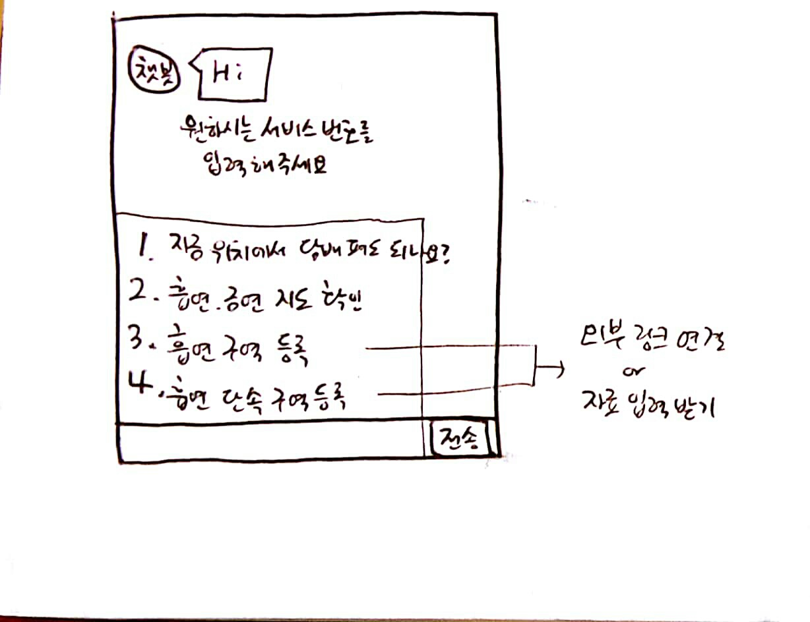
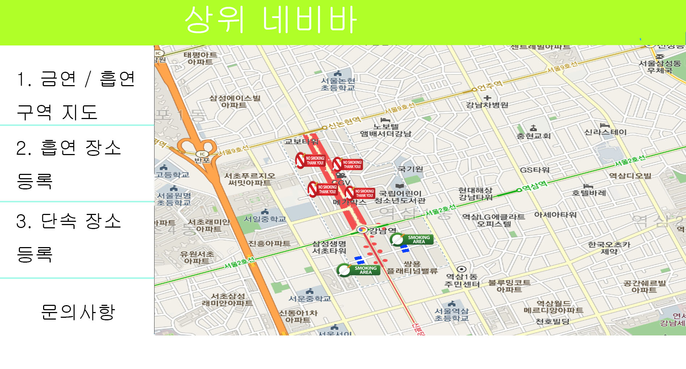

1. 프로젝트 명 : 카톡 챗봇 기반, 금연/흡연 구역 알리미

2. 프로젝트 기획의도 : 흡연자들이 벌금을 내지 않고 담배를 필 수 있는 장소를 제공하여 그들의 만족을 극대화 하기 위함.

3. 프로젝트 주요 내용

   
(챗봇버전)

현재 위치에서 담배를 펴도 되는지 챗봇에게 물어보기

내 위치 주변 지도 보여주기(금연구역 + 흡연구역)

흡연 가능 장소 등록 / 삭제 / 목록 - 링크

흡연 단속 지역 등록 / 삭제 / 목록 - 링크

가까운 흡연 장소 길찾기(소개)해주기

+) 가까운 편의점 위치, 가까운 쓰레기통 위치

(웹버전)  - 예시 화면

내 위치 주변 지도 보여주기(금연구역 + 흡연구역) - 다음 지도 + 자세히보기

흡연 가능 장소 등록 / 삭제 / 목록

흡연 단속 지역 등록 / 삭제 / 목록

가까운 흡연 장소 길찾기(소개)해주기

+) 가까운 편의점 위치, 가까운 쓰레기통 위치

#### API 사용 등

* daum 지도 API / 카톡 플러스 친구 사용
* 서울 공공데이터 (강남구 지역) - 금연구역 / 흡연구역 정보
* 정부 공공데이터 포털 ( 강남구 지역 ) - 금연구역 / 흡연구역 정보
* + + 거리 탐방

* Watson IBM  / AWS 서버 / MySQL (DB

#### 기타

 : 갑작스런 이슈 - 페미니스트, 일베 판단하기 / 신조어 검색기 - 세대공감

: 카카오 오븐  / 렌딩 페이지 / Adobe XD / 트렐로 - unity

#### 일정

18.06.12  : 5시 1차 회의 시작

18.06.15  : 흡연 단속 관련 내용 / 웹페이지 내용 추가하기. 

4. 주요 내용 별 세부내용

   4가지 항목 보여주고, 사용자가 선택하도록 유도하기.

   현재 위치에서 담배를 펴도 되는지 챗봇에게 물어보기
- 챗봇 : GPS ON 요구하기 ( 이용자 위치 확인 )
- 챗봇 : 현재 위치가 여기가 맞는지 확인 ( 지도 보여주기 )
- 이용자 : Yes -> GPS 와 지도 비교 -> 빨간색 = 금연구역 => 피면 안된다. (금연구역으로 벌금이 부과될 수 있음)- (1)
   :    -> 그 외  = 금연구역 X => 펴도 된다. (금연구역이 아니다. )- (2)
    : No -> 현재 위치가 확인되지 않습니다. 잠시만 기다려 주시겠습니까? “ 2번 물어보고 안되면, 사용자가 입력하도록 유도
   2.-  (1) 챗봇 : 가까운 흡연장소를 소개해드릴까요? -> Yes : 다음 지도 보여주고, 길찾기 해줌.(가까운 곳)
     -> No : - (2)
- (2) 챗봇 : 다른 요청사항 있습니까? -> 4가지 메뉴 보여주기.
  3.- 챗봇 : 흡연 장소를 공유 해주시겠습니까?   -> Yes : 챗봇 : 이름 / 주소명 입력 받기   -> 감사합니다.- (2)
   -> No  - (2)
  4.- 챗봇 : 당신의 현재 위치를 기반으로 한 주변 금연지도를 보여드리겠습니다. 
- 챗봇 : 사용자 위치 중심으로 한 Daum 지도 링크를 걸어준다.- (2)

